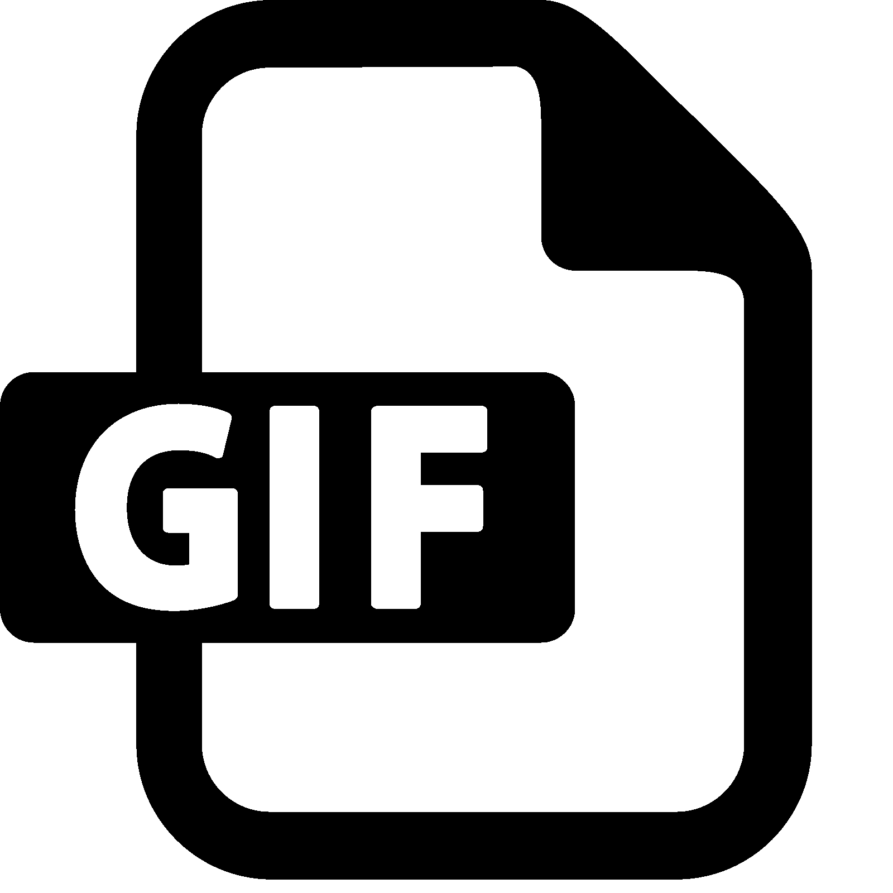

<div align="center">
	
	<h1><b>GifBar</b></h1>
	<p><b>A Mac Menu bar for getting Gifs!</b></p>
	</br>
	</br>
</div>

## Demo

[](https://snyk.io/test/github/joshghent/gifbar)
[](https://app.codacy.com/app/joshghent/gifbar?utm_source=github.com&utm_medium=referral&utm_content=joshgrent/gifbar&utm_campaign=Badge_Grade_Settings)


## Get Started 
This is a desktop application for Mac that generates a variety of gifs according to user input. 
Thank you for considering contributing to Gifbar. Any contributions are more than welcome!


Before you begin contributing to the documentation, here is a brief overview of the classes that are used in this project:

•	gifBox: You can reference this class for the queries, the giphy searching process, as well as other user interface configurations. This is essential to the application as a whole as user input searches are created and optimized here.

•	gifItem: This is a class that serves the purpose of copying the gif that is generated from the search onto the keyboard. It lets the user know that the gif is copied as well as adds the selected gif onto the copy/paste queue.  

•	gifList: This class deals with user input and mouse positions on different buttons on the applications. Essentially, you can refer to this class for creating outputs depending on which button the user selects. 

•	Index: Lastly, for this class, it has code that can launch, restart, or quit this app. 

All of the following classes listed above have been written on JavaScript. Therefore, contributions should be done in JavaScript for cohesiveness with the existing code. There is a code of conduct to be followed which can be found [here](https://github.com/joshghent/gifbar/blob/master/CODE_OF_CONDUCT.md). Furthermore, the dependencies necessary for this project are listed below:

Dependencies:

•	Babel-preset-react
•	Electron
•	Electron builder
•	Parcel bundler
•	Prettier
•	Wait-on


## Download
See all releases [here](https://github.com/joshghent/gifbar/releases).
There, you can download the `.dmg` installer or the `.app` file

## Running the app locally

```shell
$ yarn start
```

## Developing

_Watch All_
```shell
$ yarn watch
```

_Electron_
```shell
$ yarn watch:electron
```

_React_
```shell
$ yarn watch:react
```

_Create DMG_
```shell
$ yarn run package-dmg
```

_Create App_
```shell
$ yarn run package
```

## Contact
For any further information regarding questions or technical issues, please contact the project team on Twitter [@joshghent](https://twitter.com/joshghent).

## License
This project operates under the MIT License, which allows commercial and private use, as well as allows modification and distribution of this software. The authors or copyright holders are not liable for any claim, damages arising from or out of the software. More information can be found [here](https://github.com/joshghent/gifbar/blob/master/LICENSE)
